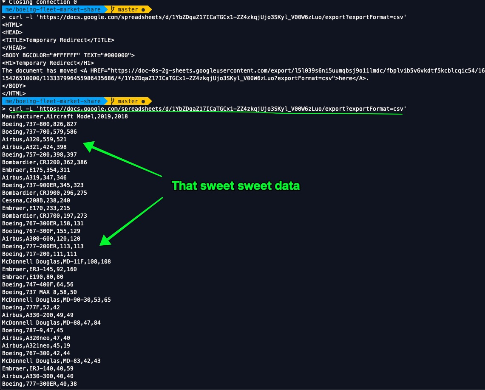

## Overview

Boeing has some big problems at fundamental levels, and it's been known to be bad for a long time.

I started growing concerned. I don't really want to fly on Boeing 737-anything. 

How much of the modern flying airliner fleet is built by Boeing? 

What percentage of modern commercial airtravel is on a plane manufactured by Boeing?

Oh, and I want to learn some D3, and this seems like a good way to go.

## Inspiration

- [People & Power - On a wing and a prayer (youtube documentary)](https://www.youtube.com/watch?v=IaWdEtANi-0)
- [Boeing 737 Next Generation (subject of documentary)](https://en.wikipedia.org/wiki/Boeing_737_Next_Generation)

This will be a sinatra app that takes some data, serves it to a page running D3, and applies a tutorial's worth of effort to "doing something" with that data. I'm more-or-less "live-streaming" this process, so someone else can follow my steps.

## Scraping Data

###  U.S. Fleet 2019 | By (Model|Manufacturer)

http://www.fi-aeroweb.com/US-Commercial-Aircraft-Fleet.html

### Associated documentation

- [Boeing 737 Next Generation (subject of documentary)](https://en.wikipedia.org/wiki/Boeing_737_Next_Generation)


--------------------

I'm first going to gather the raw data that I'll use later to visualize stuff. 

I'd like to store some data as a CSV, read it in as an `OpenStruct` (for practice?) and then return some of that data in a structured, JSON-happy way that I can consume with D3 visualizations.


# Step 1: Get some data

I want to gather the data from:

[http://www.fi-aeroweb.com/US-Commercial-Aircraft-Fleet.html](http://www.fi-aeroweb.com/US-Commercial-Aircraft-Fleet.html)

Maybe I can copy-paste?

Bleh. The data looks hard to get at with Nokogiri, too.

OK, I'm going to save this as a text file, write a little script to convert it into some legible format that can then be read into an app.

```
# 	

Manufacturer 	

Aircraft Model 	

2019 	

2018 	

CHANGE	

ALL
Boeing
Boeing
Airbus
Airbus
Boeing
Bombardier
Embraer
Airbus
Boeing
Bombardier
DC-6
777-200LR
787-10
DC-9-15F
DC-9-30F
G650/G650ER
737-300
737-200
GIV
CV-580
G550
CV-5800
767-200ER
G200
GV
Falcon 2000
Falcon 900
A330-900
750 Citation X
737-500
CN235
Falcon 20
560XL Citation Excel
ERJ-135
MD-82
800XP
EMB 120
C-46
PC-12
A310
G450
SF-340A

7,381
826
579
559
424
398
362
354
347
345
296
238
233
197
14
13
13
1
1
1
1
1
1
1
1
0
0
0

7,356
827
586
521
160
80
56
50
65
42
49
84
45
40
7
7
1 
```

Ugh. Super ugly. Copy-pasted into a google sheets spreadsheet, available here:

[https://docs.google.com/spreadsheets/d/1YbZDqaZ17ICaTGCx1-ZZ4zkqjUjo3SKyl_V00W6zLuo/edit?usp=sharing](https://docs.google.com/spreadsheets/d/1YbZDqaZ17ICaTGCx1-ZZ4zkqjUjo3SKyl_V00W6zLuo/edit?usp=sharing)

I wonder how to programmatically download/parse a CSV in Google sheets...

https://dev.to/kojikanao/download-files-from-google-drive-with-curl-wget-5e4o

Let's see, we need the `file_id` which seems like:

```
https://docs.google.com/spreadsheets/d/1YbZDqaZ17ICaTGCx1-ZZ4zkqjUjo3SKyl_V00W6zLuo/edit?usp=sharing
#                                      ^----------------File ID-------------------^

# 1YbZDqaZ17ICaTGCx1-ZZ4zkqjUjo3SKyl_V00W6zLuo
```

Oh, and aparently we'll use `wget` instead of `curl`? I don't remember much about `wget`, but looks like it's a "download files from the web" utility. Checks out.

```
$ wget download_url -O file_name
```

In this case, download_url is comprised of:

```
https://drive.google.com/uc?export=download&id=<fileId>
```

So, let's try:

https://drive.google.com/uc?export=download&id=1YbZDqaZ17ICaTGCx1-ZZ4zkqjUjo3SKyl_V00W6zLuo

Nope, but THIS WORKED!!!

```
> curl -L 'https://docs.google.com/spreadsheets/d/1YbZDqaZ17ICaTGCx1-ZZ4zkqjUjo3SKyl_V00W6zLuo/export?exportFormat=csv'
```

w/o the `-L` I was hitting a redirect. Check out this sweet output:



--------------------

Unfortunately it's only the "top" sheet - I have three sheets of data in the report, so I'll see how to handle that later. Maybe I can pass in another parameter for additional sheets. 

I'll deal with that later. 

I guess I'll make a little ruby object out of this, and make it storable.

```ruby
# for each row in CSV, call 
```
